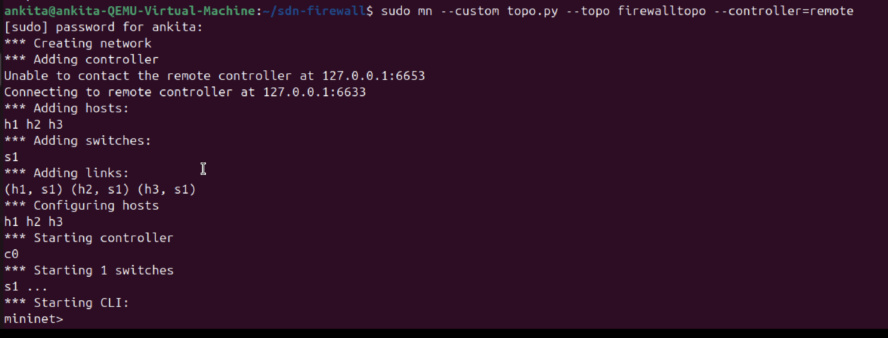
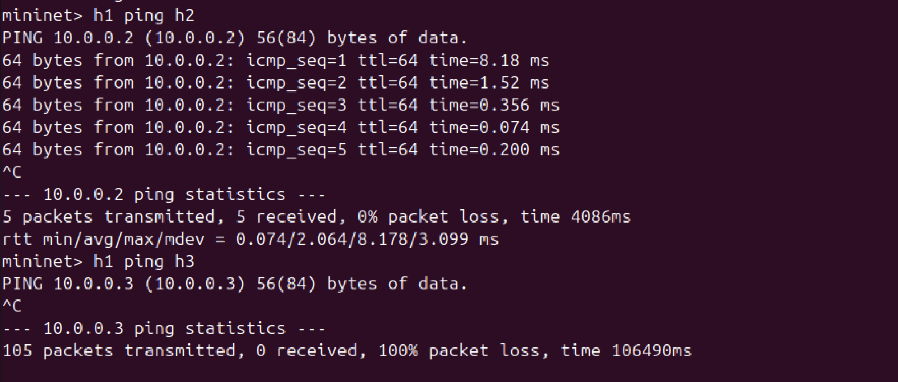
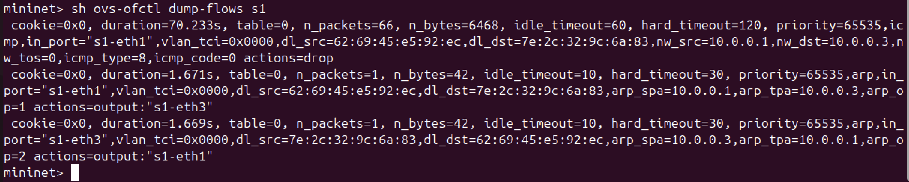
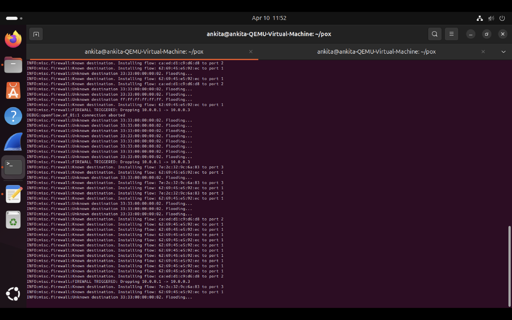
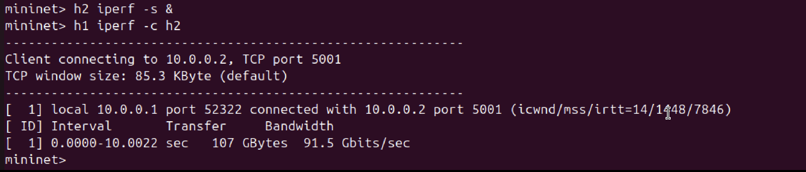

# SDN-Based Firewall using POX

## Project Overview

This project implements a **Software Defined Networking (SDN) firewall** using the **POX controller** and **Mininet**.

The firewall dynamically controls network traffic by allowing or blocking communication between hosts based on predefined rules.

---

## Network Topology

* 1 Switch (s1)
* 3 Hosts:

  * h1 → 10.0.0.1
  * h2 → 10.0.0.2
  * h3 → 10.0.0.3

All hosts are connected to a single switch.

---

## Technologies Used

* Python
* Mininet
* POX Controller
* OpenFlow Protocol

---

## How to Run the Project

### 1. Start POX Controller

```bash
cd ~/pox
./pox.py log.level --DEBUG misc.firewall
```

### 2. Run Mininet Topology

```bash
cd ~/sdn-firewall
sudo mn --custom topo.py --topo firewalltopo --controller=remote
```

---

## Testing

### Allowed Traffic

```bash
h1 ping h2
```

### Blocked Traffic

```bash
h1 ping h3
```

---

## Flow Table Verification

```bash
sh ovs-ofctl dump-flows s1
```

---

## 📈 iPerf Test

```bash
h2 iperf -s &
h1 iperf -c h2
```

---

## 📸 Screenshots

### Mininet Initialization



### Ping Tests



### Flow Table



### POX Logs



### iPerf Test



---

## Key Features

* Centralized control using SDN
* Dynamic flow rule installation
* Traffic filtering (allow/block)
* Real-time monitoring using logs

---

## Conclusion

This project demonstrates how SDN can be used to implement flexible and programmable network security using a centralized controller.

---

## Author

Ankita Pramod
